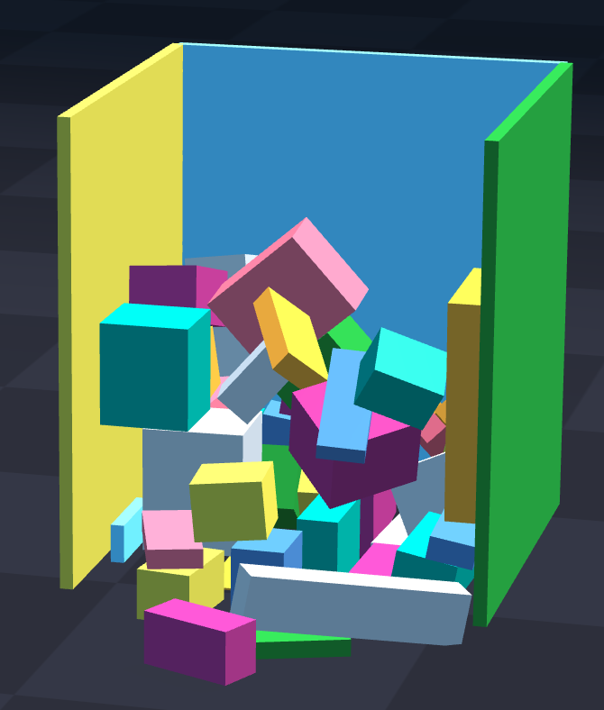
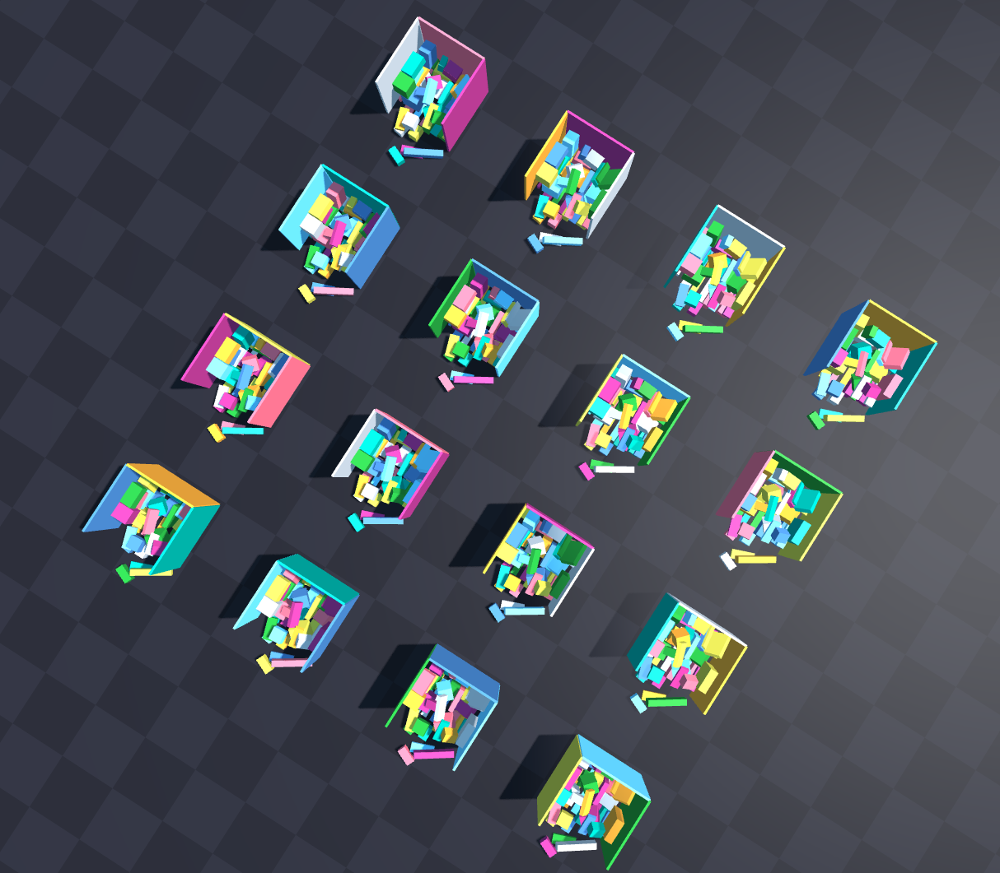

# Unloading scene generation using newton simulator

## Environment Setup

Create and activate a conda environment with Python 3.11:

```bash
conda create -n newton_unload python=3.11
conda activate newton_unload
```

Install the required packages:

```bash
pip install -r requirements.txt
```
## Scene Generation

```bash
python -m examples.rot_partition_sim --ne 1 --nb 50 --solver mujoco --dims 1 1 1.3 --remove-wall 0 --save-snapshot ./data/box50.npz --vis
```
<p align="center">
  
</p>

## Unload Plan

```bash
python -m plans.unload_batch --snapshot ./data/box50.npz --ne 16 --removal_planner height --vis 
```
<p align="center">
  
</p>